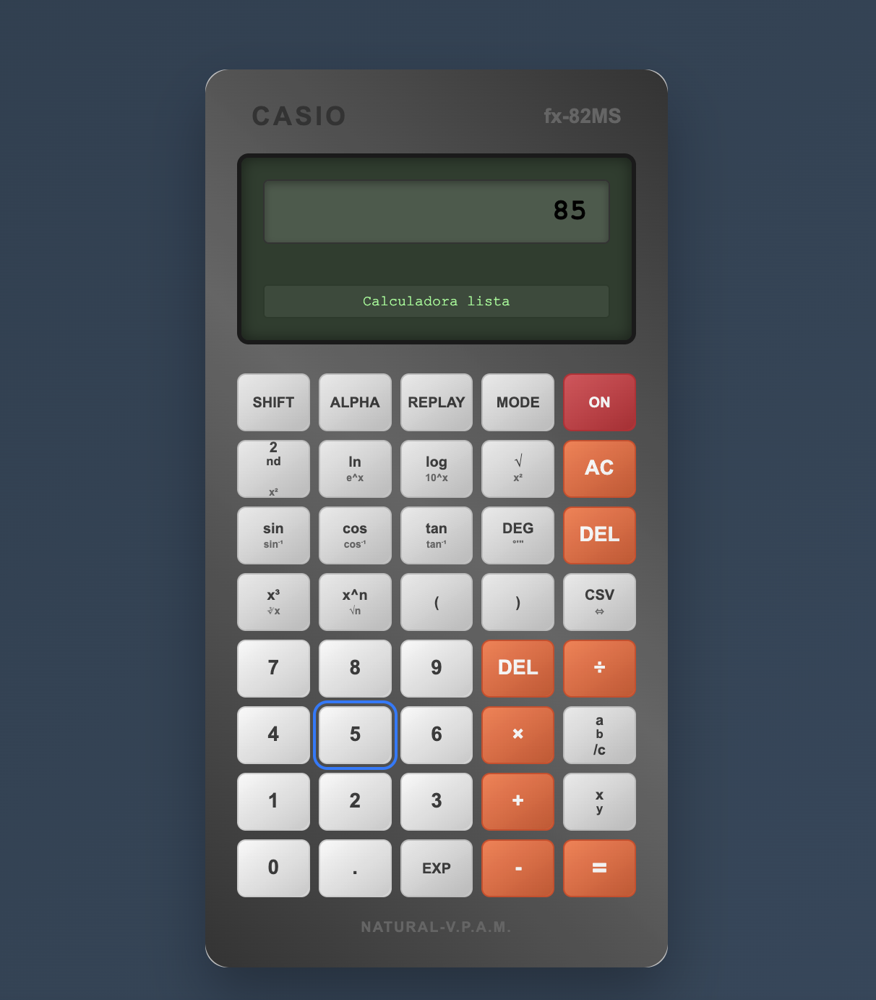

# 📟 Calculadora CASIO FX-82 (Versión Web)

Proyecto de **Paula Cantera Chamarro**.  
Réplica funcional de la calculadora científica Casio FX-82MS desarrollada con **HTML, CSS y JavaScript**.

## 🚀 Enlaces
- 📂 **Repositorio público**:  
  https://github.com/paulacanterachamarro/Mi-Pequena-Calculadora-PaulaCanteraChamarro
- 🔗 **Calculadora online (GitHub Pages)**:  
  https://paulacanterachamarro.github.io/Mi-Pequena-Calculadora-PaulaCanteraChamarro/
  

## ✨ Funcionalidades
- Operaciones básicas: suma, resta, multiplicación, división
- Operaciones avanzadas: potencias, raíces, logaritmos, trigonometría
- Modal CSV: suma, media, quitar último, quitar específico, limpiar
- Modo SHIFT/ALPHA e indicadores de modo (DEG/RAD/GRAD)
- Registro de errores descargable (.txt) y compatibilidad con teclado
- Manejo de errores (división por cero, dominios inválidos, etc.)

## 📂 Estructura
├── index.html
├── styles.css
├── script.js
├── script-original.js 
└── README.md

## 🖥️ Tecnologías
HTML5 · CSS3 · JavaScript (ES6+)

## 👩‍💻 Autora
**Paula Cantera Chamarro** · 2025

